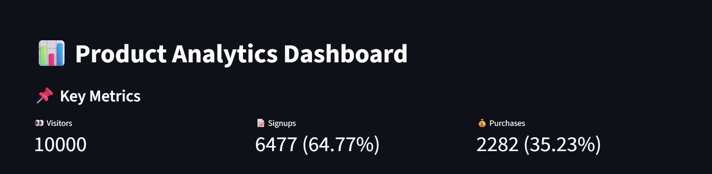
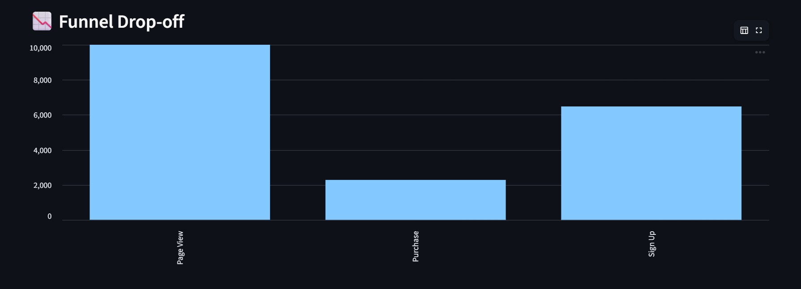

# 📊 Product Analytics Pipeline

## 🚀 Overview
This project simulates a real-world product analytics system for a SaaS learning platform.  
It tracks user behavior, analyzes conversion funnels, performs A/B testing, and evaluates user retention.

---

## 🎯 Problem Statement
In many SaaS platforms, users sign up but fail to convert into paying customers.  
This project analyzes user behavior to identify drop-offs, test improvements, and optimize conversion rates using data-driven insights.

---

## 🧱 Architecture
Frontend → Event Tracking → Data Storage (PostgreSQL) → SQL Analysis → Dashboard (Streamlit)

---

## ⚙️ Tech Stack
- Python  
- PostgreSQL  
- SQL  
- Streamlit  

---

## 📂 Project Structure
pipeline/ → data generation & loading
sql/ → analysis queries
dashboard/ → Streamlit dashboard
app/ → frontend simulation (Flask/Streamlit)
analysis/ → exploratory analysis
images/ → dashboard screenshots


---

## 📈 Key Features

### 1. Funnel Analysis
- Tracks user journey from page view → signup → purchase  
- Identifies conversion drop-offs  

### 2. A/B Testing
- Compares two user variants (A vs B)  
- Measures impact on conversion rates  
- Variant B improved conversion by ~10%  

### 3. Cohort Analysis
- Groups users by first activity date  
- Tracks retention over time  

---

## 📊 Dashboard Preview

### 📌 Key Metrics


---

### 📉 Funnel Analysis


---

### 🧪 A/B Test Results


---

### 🔥 Cohort Analysis


---

## 📊 Key Insights

- ~60% of users sign up after visiting  
- ~30% convert into paying customers  
- ~70% drop-off occurs after signup  
- A/B testing showed ~10% improvement in conversions  

---

## 💡 Business Impact

- Identified key drop-off stage in the user journey  
- Demonstrated how A/B testing improves conversion rates  
- Provided retention insights using cohort analysis  
- Enabled data-driven product decision-making  

---

## 📌 Conclusion
This project demonstrates how product analytics can be used to:
- Optimize conversion funnels  
- Improve user retention  
- Drive business growth using data  

---

## ▶️ How to Run

```bash
python pipeline/generate_data.py
python pipeline/load_data.py
python -m streamlit run dashboard/analytics_dashboard.py


---
# 🌟 Future Improvements
Add real-time data ingestion
Deploy dashboard online
Improve cohort visualization with heatmaps


---

