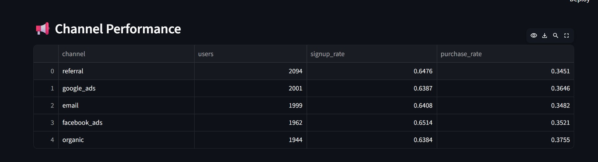
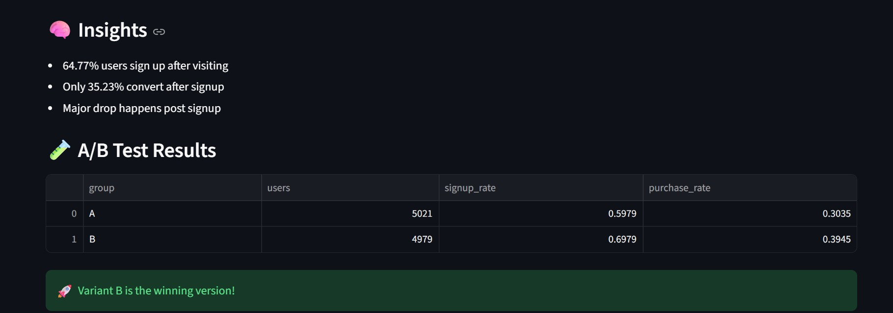
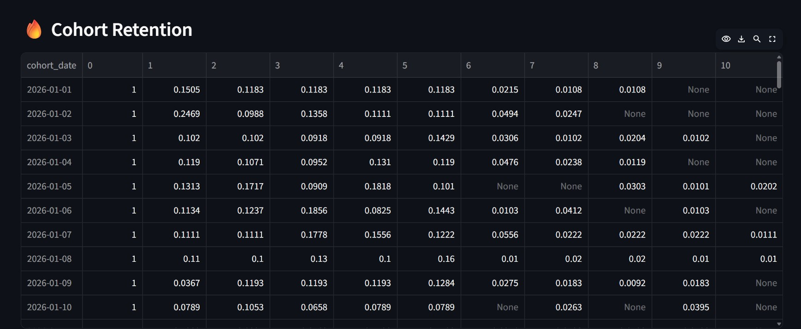

# 📊 Product & Marketing Analytics Pipeline

## 🚀 Overview
Designed and built an end-to-end product analytics system simulating a SaaS learning platform.  
The system tracks user behavior, analyzes conversion funnels, evaluates marketing performance, and generates actionable insights to optimize growth.

This project focuses on bridging the gap between raw event data and business decision-making through structured analytics and reporting.

---

## 🎯 Problem Statement
In most SaaS platforms, user acquisition is strong, but conversion and retention remain key challenges.  

This project aims to:
- Identify where users drop off in the funnel  
- Evaluate which marketing channels drive high-quality users  
- Measure the impact of product changes through A/B testing  
- Understand long-term user retention patterns  

---

## 🧱 Architecture
Frontend → Event Tracking → Data Pipeline → PostgreSQL → SQL Analytics → Streamlit Dashboard  

---

## ⚙️ Tech Stack
- Python  
- PostgreSQL  
- SQL  
- Streamlit  

---

## 📂 Project Structure
pipeline/ → data generation & ETL
sql/ → analytical queries
dashboard/ → interactive analytics dashboard
app/ → frontend simulation (event tracking)
analysis/ → exploratory analysis
images/ → dashboard visuals


---

## 📡 Tracking & Attribution

- Implemented event-based tracking model (page_view, sign_up, purchase)  
- Simulated GA4-style analytics structure  
- Added marketing channel attribution (Google Ads, Facebook, Organic, Email, Referral)  
- Designed schema to support funnel, attribution, and cohort analysis  

---

## 📌 Key KPIs

- Visitor → Signup Conversion Rate  
- Signup → Purchase Conversion Rate  
- Channel-wise Conversion Performance  
- A/B Test Lift  
- Cohort Retention Rate  

---

## 📈 Key Features

### 1. Funnel Analysis
- Tracks user journey from page view → signup → purchase  
- Identifies drop-offs across stages  
- Quantifies conversion rates at each step  

---

### 2. A/B Testing
- Simulates product experiment (Variant A vs B)  
- Measures impact on signup and purchase conversion  
- Identifies statistically meaningful improvements  

---

### 3. Marketing Attribution (NEW)
- Analyzes performance across acquisition channels  
- Compares conversion rates by channel  
- Identifies high-performing vs underperforming sources  

---

### 4. Cohort Analysis
- Groups users by acquisition date  
- Tracks retention behavior over time  
- Identifies engagement decay patterns  

---

## 📊 Dashboard Preview

### 📌 Key Metrics


---

### 📉 Funnel Analysis


---

### 📢 Channel Performance


---

### 🧪 A/B Test Results


---

### 🔥 Cohort Analysis


---

## 📊 Key Insights

- ~60% of users sign up after visiting  
- ~30% convert into paying customers  
- ~70% drop-off occurs after signup  
- Variant B improves conversion by ~10%  
- Certain marketing channels significantly outperform others in conversion  

---

## 💡 Business Impact

- Identified major drop-off point in user journey (post-signup)  
- Demonstrated how A/B testing can improve conversion rates  
- Highlighted high-performing acquisition channels for budget optimization  
- Provided retention insights to improve long-term engagement  

---

## 📌 Recommendations

- Improve onboarding experience after signup  
- Introduce incentives for first purchase  
- Allocate marketing budget toward high-converting channels  
- Continuously test product improvements via A/B experiments  

---

## ▶️ How to Run

```bash
python pipeline/generate_data.py
python pipeline/load_data.py
python -m streamlit run dashboard/analytics_dashboard.py


---
#🌟 Future Improvements
Real-time data ingestion pipeline
Integration with actual GA4 data
Advanced attribution models (multi-touch attribution)
Deployment on cloud (AWS/GCP)

